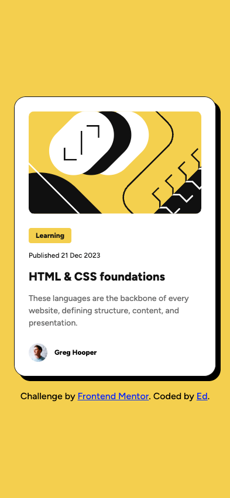
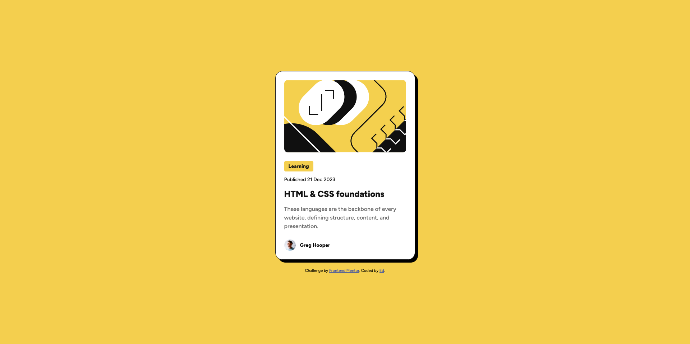

# Blog Preview Card

This is a solution to the [Blog preview card challenge on Frontend Mentor](https://www.frontendmentor.io/challenges/blog-preview-card-ckPaj01IcS). The goal was to build a responsive blog teaser card component with fluid typography, semantic HTML, and interactive hover/focus states—matching the provided design as closely as possible.

## Table of contents

- [Overview](#overview)  
  - [The challenge](#the-challenge)  
  - [Screenshot](#screenshot)  
  - [Links](#links)  
- [My process](#my-process)  
  - [Built with](#built-with)  
  - [What I learned](#what-i-learned)  
  - [Continued development](#continued-development)  
  - [Useful resources](#useful-resources)  
- [Author](#author)  
- [Acknowledgments](#acknowledgments)  

---

## Overview

### The challenge

Users should be able to:
- View a fully responsive card (at 375px mobile and 1440px desktop) that closely matches the static design files.
- Experience visible hover and focus states on all interactive elements (links and the card itself).
- See font-sizes smoothly scale between mobile and desktop without any media queries (using `clamp()` + `vw`/`px` math).
- Have a semantic HTML structure (including `<header>` for metadata and `<footer>` for author attribution).

### Screenshot

  
*Mobile view*

  
*Desktop view*

### Links

- Solution URL: [https://github.com/edjohnsondev/blog-preview-card](https://github.com/edjohnsondev/blog-preview-card)  
- Live Site URL: [https://blog-preview-card-gamma-ebon.vercel.app/](https://blog-preview-card-gamma-ebon.vercel.app/)  

---

## My process

### Built with

- **Semantic HTML5**  
  - Used `<article>`, `<header>`, and `<footer>` to structure the card.  
  - Employed `<time>` with a `datetime` attribute for machine-readable dates.

- **SCSS (Sass)**  
  - Nesting (`&__element`, `&:hover { … }`) to keep styles organized.  
  - Variables for colors and spacing in a `variables.scss` file.

- **CSS3**  
  - Custom properties (CSS variables) for theme consistency (colors, font-sizes, spacing).  
  - Flexbox for layout alignment (e.g., centering author info, stacking header elements).  
  - `clamp()` + `vw`/`px` calculations for fluid typography (no media queries).  

### What I learned

- **Making font sizes grow smoothly with `clamp()`**  
  Instead of hard‐coding breakpoints, I wanted the title and text sizes to start smaller on a 375px‐wide phone and grow to their bigger sizes on a 1440px‐wide desktop. Here’s how I made it easy to understand:

  1. **Pick the two points.**  
     - On a phone (375px wide), the title should be 20px.  
     - On a desktop (1440px wide), the title should be 24px.

  2. **Figure out how much it needs to grow.**  
     - Difference between 24px and 20px is 4px total growth.  
     - The screen grows from 375px to 1440px, that’s 1065px of extra width.  
     - So for every 1065px of screen, the font grows 4px. In other words, for each 1px of screen width, it grows 4 ÷ 1065 ≈ 0.00375px of font.

  3. **Turn that into “vw” units.**  
     - In CSS, `1vw` means 1% of the viewport (so on a 1000px‐wide screen, `1vw` = 10px).  
     - To make 0.00375px per 1px of screen, multiply 0.00375 × 100 → 0.375. That means `0.375vw` grows by the right amount to cover 4px growth over those 1065px.  

  4. **Find the starting number.**  
     - At 375px of screen, `0.375vw` is `0.375%` of 375px, which is 1.40625px. We want the final to be 20px on a 375px screen, so we need to add about 18.59375px to that.  
     - Rounding to simpler decimals (0.375vw + 18.59px) means:  
       - On 375px screens: `0.375 × 3.75 + 18.59 ≈ 20px`.  
       - On 1440px screens: `0.375 × 14.4 + 18.59 ≈ 24px`.  

  5. **Plug into `clamp()`** so it never gets smaller than 20px or larger than 24px:  
     ```css
     font-size: clamp(
       20px, 
       calc(0.375vw + 18.59px), 
       24px
     );
     ```
  6. **Repeat for the other text sizes** (16↔14px and 14↔12px) with the same steps:  
     - Find how many pixels difference.  
     - Divide by 1065 to get the “px of font per px of screen.”  
     - Multiply by 100 to use as “vw.”  
     - Calculate the intercept so that at 375px of screen, the `calc()` result equals the mobile font size.  
     - Wrap it in `clamp(mobile, calc(...), desktop)`.

  This way, the browser never uses media queries— it just calculates a number based on viewport width and stops at min and max. On a small phone, it stays exactly at the “mobile size.” On a big monitor, it stays exactly at the “desktop size.” In between, it smoothly climbs.

- **Structuring content semantically**  
  - Wrapping category, date, and title in an `<header>` improved accessibility: screen readers can jump directly to the article’s header information.  
  - Moving author attribution into an `<footer>` inside the `<article>` clarified that this content was “closing metadata” rather than part of the main text.

- **SCSS nesting to keep CSS modular**  
  - Using SCSS made it easy to scope hover states (`&:hover h2`) and sub-elements (`&__image img { … }`) under the `.blog-card` parent.  
  - This organization simplified future maintenance—if I rename the root class, nested selectors update automatically.

### Continued development

- **Improve accessibility with ARIA labels**  
  - Currently, the author’s `` has an alt text of “Author Avatar,” but I could add `aria-label="Author: [Your Name]"` on the footer `<span>` for extra clarity.  
  - Consider adding an invisible skip link or focus‐trap logic if this card is used within a larger, complex page.

- **Add JavaScript-driven “Read More” or “Share” toggles**  
  - The static card is complete, but if I wanted to extend it, I could add interactive buttons (e.g., a “Share” icon that opens social links).  
  - I’d practice writing minimal vanilla JS to handle click events and keyboard interactions.

- **Experiment with CSS Grid**  
  - Currently, the layout relies on Flexbox. For more complex card layouts (like multi-column footers or dynamic tag lists), learning CSS Grid patterns would be beneficial.

### Useful resources

- [“Fluid Typography with `clamp()`” (CSS-Tricks)](https://css-tricks.com/linearly-scale-font-size-with-css-lock/)  
  → This article walked me through the exact math steps for interpolation and how to implement them in `clamp()`.

- [MDN Web Docs: Using CSS `clamp()`](https://developer.mozilla.org/en-US/docs/Web/CSS/clamp)  
  → Great reference for syntax, browser support, and examples.

- [Frontend Mentor Community Forum](https://www.frontendmentor.io/forum)  
  → I searched for tips on “no-media-queries approach” and found several threads explaining best practices for fluid scaling.

---

## Author

- **Your Name Here**  
- GitHub – [@edjohnsondev](https://github.com/edjohnsondev/)  
- Frontend Mentor – [@edjohnsondev](https://www.frontendmentor.io/profile/edjohnsondev)  
- Portfolio – [@edjohnsondev](https://edjohnson.io)  

---

## Acknowledgments

- Thanks to **Frontend Mentor** for providing the design files and challenge format.  
- Thanks to **CSS-Tricks** for the in-depth guide on `clamp()` and fluid typography math.  
- Shout-out to the **Frontend Mentor Community** reading through other solutions inspired my approach to SCSS structuring and accessibility best practices.  
