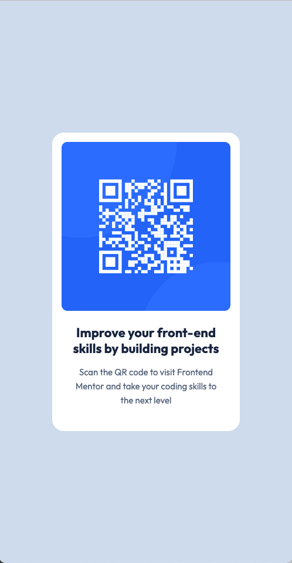
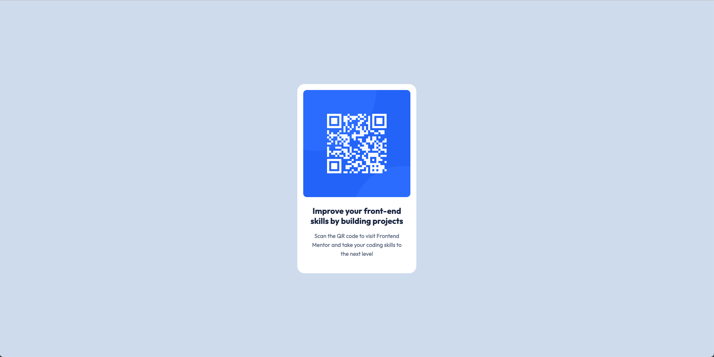

# Frontend Mentor - QR code component solution

This is a solution to the [QR code component challenge on Frontend Mentor](https://www.frontendmentor.io/challenges/qr-code-component-iux_sIO_H). It demonstrates a semantic, responsive QR code card built with plain HTML and CSS.

## Table of contents

- [Overview](#overview)  
  - [Screenshot](#screenshot)  
  - [Links](#links)  
- [My process](#my-process)  
  - [Built with](#built-with)  
  - [What I did](#what-i-did)  
  - [Continued development](#continued-development)  
  - [Useful resources](#useful-resources)  
- [Author](#author)  
- [Acknowledgments](#acknowledgments)  

---

## Overview

A clean, mobile-first QR code component that matches the provided design at both 375px (mobile) and 1440px (desktop). The layout uses a centered “artboard” wrapper, and all theming—colors, typography, spacing and border-radii—are managed via CSS custom properties.

### Screenshot

  
*Mobile view (375px width)*

  
*Desktop view (1440px width)*

### Links

- **Solution URL**: https://github.com/edjohnsondev/qr-code-component  
- **Live Site URL**: https://qr-code-component-psi-dusky.vercel.app/  

## My process

### Built with

- **HTML5** with semantic structure inside a `<main>` and a wrapper `
` for the artboard  
- **CSS3** using:
  - Custom properties for colors (`hsl` values), typography sizes, spacing tokens (`--space-200`, `--space-300`, `--space-500`) and border radii  
  - Google Fonts import for the “Outfit” typeface  
  - Flexbox to center the card both vertically and horizontally  
  - A single desktop media query to expand the artboard wrapper to 1440px  
- **Responsive, mobile-first workflow** tested from 320px up to large desktop screens  

### What I did

- Defined a small set of CSS variables in `:root` to drive the entire theme (colors, font sizes, spacing, border-radii) so any design tweak happens in one place.  
- Created a `.wrapper` container that caps its width at 375px on mobile (with padding) and at 1440px on desktop, and uses Flexbox to center the QR card.  
- Built the card markup using simple `
` containers (`.qr-container`, `.qr-image`, `.qr-content`) rather than extra semantic elements, then applied utility classes (`.text-heading`, `.text-body`) for typography consistency.  
- Applied `border-radius` and `box-shadow` on the card container, and a smaller radius on the QR image itself to match the design’s rounded corners.  
- Imported the favicon and set the `<meta viewport>` for proper scaling on all devices.  

### Continued development

- Add hover and focus states on the card for better interactivity and keyboard accessibility.  
- Experiment with fluid typography using `clamp()` so text scales smoothly between breakpoints.  
- Implement a dark-mode toggle by switching CSS variable sets.  

### Useful resources

- **MDN Web Docs** – reference for CSS custom properties and Flexbox  
- **CSS-Tricks** – guides on theming with variables and responsive design patterns  
- **Frontend Mentor Community** – discussions and examples of mobile-first artboard layouts  

## Author

- GitHub – [@edjohnsondev](https://github.com/edjohnsondev/)  
- Frontend Mentor – [@edjohnsondev](https://www.frontendmentor.io/profile/edjohnsondev)  
- Portfolio – [@edjohnsondev](https://edjohnson.io)  

## Acknowledgments

- Thanks to **Frontend Mentor** for the design assets and challenge format.  
- Appreciation to the **Frontend Mentor Community** for feedback on responsive and theming techniques.  
- Inspired by articles on **CSS-Tricks** and **MDN Web Docs**.  
