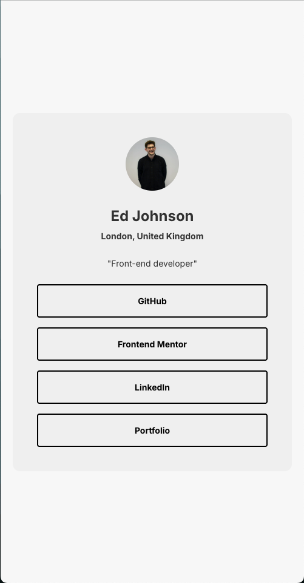
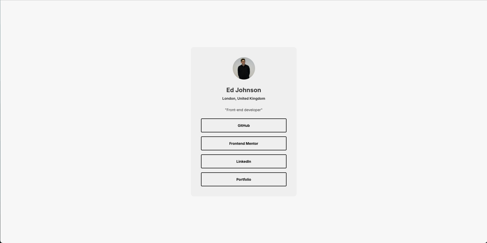

# Frontend Mentor - Social links profile solution

This is a solution to the [Social links profile challenge on Frontend Mentor](https://www.frontendmentor.io/challenges/social-links-profile-UG32l9m6dQ). Frontend Mentor challenges help you improve your coding skills by building realistic projects.

## Table of contents

- [Overview](#overview)  
  - [The challenge](#the-challenge)  
  - [Screenshot](#screenshot)  
  - [Links](#links)  
- [My process](#my-process)  
  - [Built with](#built-with)  
  - [What I learned](#what-i-learned)  
  - [Continued development](#continued-development)  
  - [Useful resources](#useful-resources)  
- [Author](#author)  
- [Acknowledgments](#acknowledgments)  

---

## Overview

### The challenge

Users should be able to:

- Navigate all links by keyboard (tab focus)  
- See clear hover and focus states on each social link button  
- View a responsive profile card at both 375px mobile and wider desktop sizes  
- Experience a semantic HTML structure and consistent theming via CSS custom properties

### Screenshot

  
*Mobile view*

  
*Desktop view*

### Links

- **Solution URL**: [https://github.com/edjohnsondev/social-links-profile](https://github.com/edjohnsondev/social-links-profile)  
- **Live Site URL**: [https://social-links-profile-edjohnson.netlify.app/](https://social-links-profile-edjohnson.netlify.app/)  

## My process

### Built with

- **HTML5**  
  Plain semantic markup (`<section>`, `
`, ``, `<h1>`, `
`, `<a>`)  
- **SCSS (compiled to CSS)**  
  - CSS custom properties for colors, spacing, typography, and border-radii  
  - Utility classes for text presets and buttons  
- **Bootstrap Grid**  
  Imported `bootstrap-grid.min.css` to handle the responsive container, row, and column layout.  
- **Button hovers**  
  Played around with pseudo-elements (`::before`/`::after`) to create a sliding fill effect  

### What I learned

- **CSS custom properties** let me centralize theme values (colors, spacings, font sizes) so any design tweak happens in one place. 
- **Pseudo elements** Understanding how to use pseudo elements and manipulate them on hover. 
- **Bootstrap** Used Bootstrap’s grid system for rapid, responsive column layout—while it doesn’t match the 375 px/1440 px artboard widths exactly, it provided a familiar, reliable structure for placing the card at the center and handling different screen sizes without writing custom media queries.

### Continued development

- **Dark mode toggle**: leverage CSS variables to switch to a dark palette via `prefers-color-scheme` or a manual toggle.  
- **Enhanced hover states**: add subtle scale or shadow transitions to buttons for richer feedback.
- **Semantic HTML**: Introduce more semantic html, article, nav figure.

### Useful resources

- [MDN Web Docs: CSS Custom Properties](https://developer.mozilla.org/en-US/docs/Web/CSS/--*) – deep dive on variables.  
- [CSS-Tricks: A Complete Guide to Flexbox](https://css-tricks.com/snippets/css/a-guide-to-flexbox/) – for flexible centering and layout.  
- [Frontend Mentor Community](https://www.frontendmentor.io/community) – helpful threads on accessibility and responsive patterns.

## Author

- **Ed Johnson**  
- GitHub – [@edjohnsondev](https://github.com/edjohnsondev)  
- Frontend Mentor – [@edjohnsondev](https://www.frontendmentor.io/profile/edjohnsondev)  
- Portfolio – [https://edjohnson.io](https://edjohnson.io)  

## Acknowledgments

- Thank you to **Frontend Mentor** for the design assets and clear challenge requirements.  
- Shout-out to the **Frontend Mentor Community** for accessibility and CSS custom property tips.  
- Inspired by articles on **CSS-Tricks** and **MDN Web Docs** throughout this build.  
